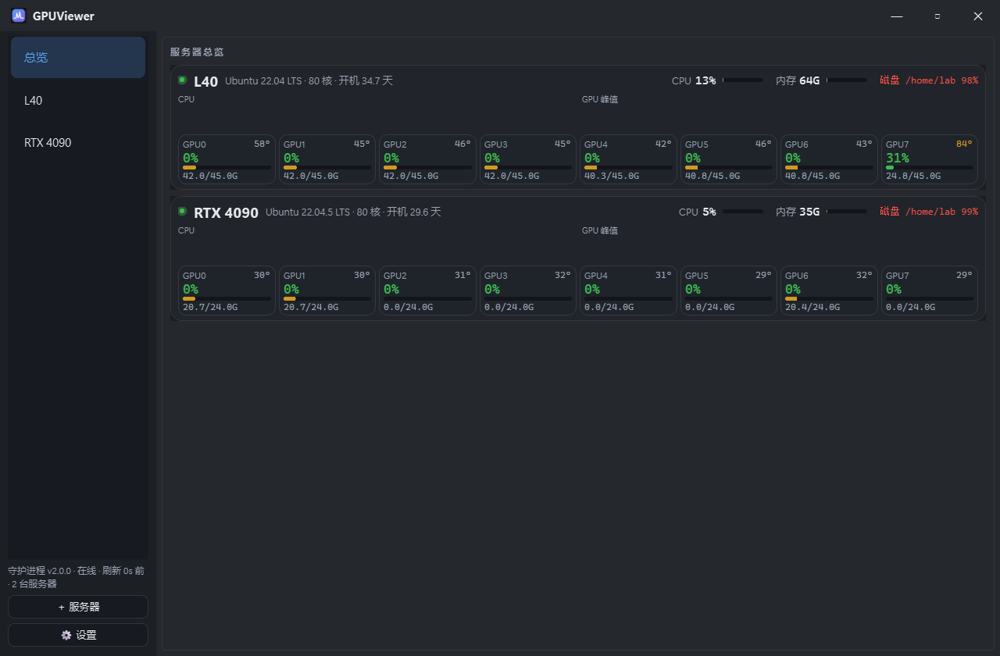
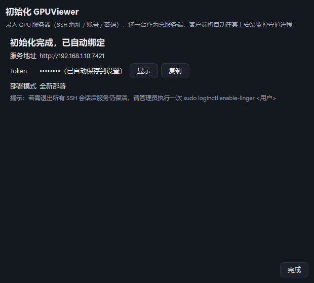
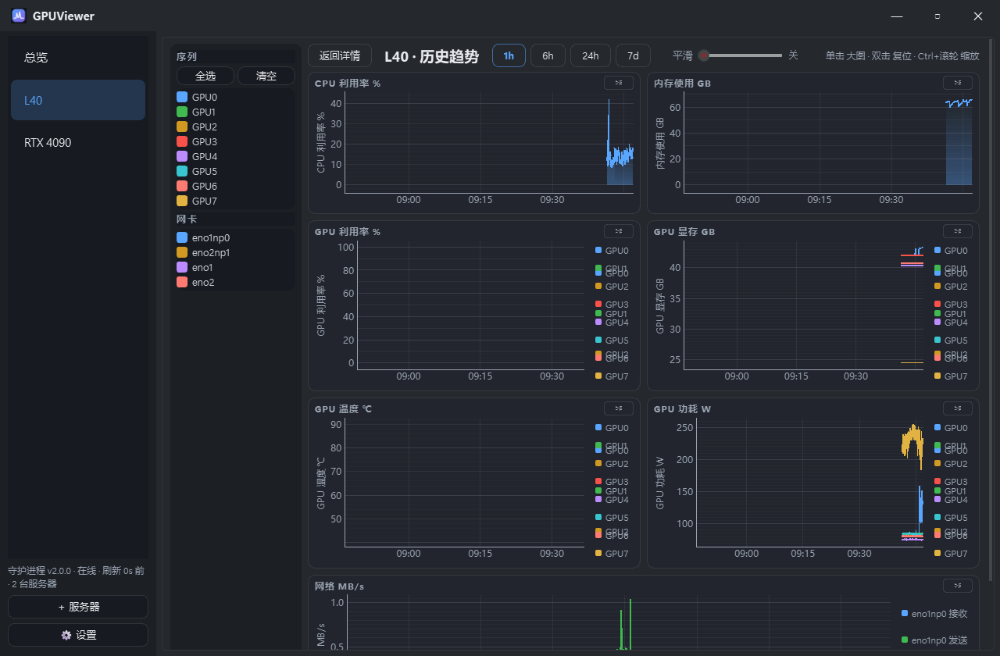
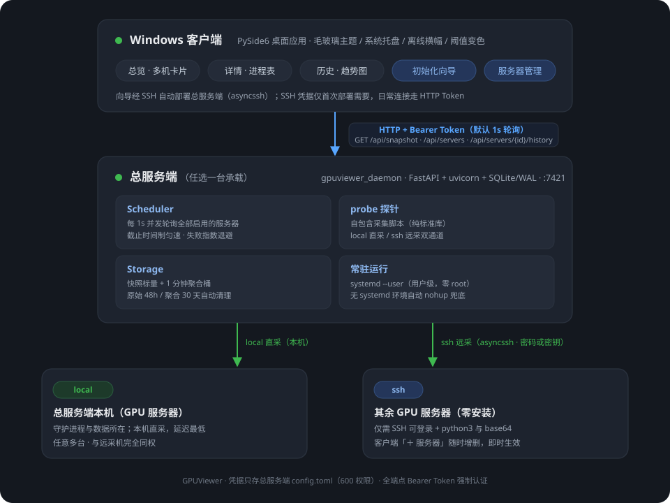

# GPUViewer

[](../../actions)
[](LICENSE)
[](https://www.python.org)

多服务器 GPU 集群实时监控与历史趋势查看器：**Linux 服务器端零 root 采集守护进程 + Windows 桌面客户端**。第一次使用只需在客户端里输入服务器的 SSH 地址/账号/密码，初始化向导会自动完成其余一切——部署、配置、启动、绑定。



 

## 特性

- **全量指标**：GPU（利用率/显存/温度/功耗/风扇）、占卡进程表（对标 nvitop：CPU%、宿主内存、SM%、显存带宽%、显存占比）、CPU/内存/负载、磁盘、网络速率、TOP 进程
- **多机一屏**：任意多台服务器总览卡片 + 单机详情页 + 默认 1 秒刷新
- **历史趋势**：48 小时原始 + 30 天自动聚合；全 GPU 曲线、时间轴选择、联动缩放、图例统计
- **初始化向导**：录入服务器 → 选一台当总服务端 → 客户端经 SSH 自动安装守护进程（建 venv、装依赖、生成随机 Token、注册 systemd 用户服务，失败自动 nohup 兜底）→ 地址与 Token 自动绑定
- **非总服务端零安装**：守护进程经 SSH 直接采集（目标机仅需 python3 与 base64），添加/删除服务器即时生效
- **零 root**：全部组件以普通用户运行；服务器无 venv 时自动降级 get-pip --user 安装
- **轻量**：daemon 常驻 ≈63MB RSS、≈1.4% 单核（8+8 卡双机 1s 采集实测）；快照接口端到端 ≈33ms

## 架构

<p align="center">
  
</p>

- 服务端：`gpuviewer_daemon`（FastAPI + SQLite），本机直采 + SSH 远采双通道，被监控机完全同权
- 客户端：`gpuviewer_client`（PySide6），总览/详情/历史三页，内置 SSH 自动部署引擎
- 通信：HTTP + Bearer Token，全部端点强制认证；凭据只存总服务端 `config.toml`（600 权限）

## 快速开始（Windows 客户端）

前置：Windows 10/11 + [Python 3.10+](https://www.python.org/downloads/)（安装时勾选 Add to PATH）。

```powershell
git clone https://github.com/LinYuan-iMc/gpuviewer.git
cd gpuviewer
powershell -ExecutionPolicy Bypass -File scripts\quickstart_windows.ps1
```

脚本自动完成：虚拟环境 → 依赖安装（约 100MB）→ 桌面快捷方式。之后双击桌面 **GPUViewer** 即可。

免装方式：从 [Releases](../../releases) 下载 `GPUViewer.exe`，双击即用（无需 Python）。

### 首次使用：初始化向导

首次启动自动进入向导，三步完成：

1. **录入服务器**：每台填 SSH 地址/端口/账号/密码，可先点「测试连接」预检（Python ≥3.9、base64、nvidia-smi）；
2. **选总服务端**：守护进程装在这一台上（存储全部历史）；其余服务器不做任何安装；
3. **开始部署**：全自动——上传代码、写配置（随机 Token）、装依赖、起服务、健康检查；完成即自动绑定开始监控。

注意事项：

- 总服务端需放行 7421/tcp（如 `sudo ufw allow 7421/tcp`），客户端才能连上（向导的健康检查会明确提示）；
- 密码仅首次部署需要：日常连接走 HTTP Token，总服务端 SSH 凭据存本地（升级重部署免输入）；
- 退出全部 SSH 会话后服务仍需保活的话，请管理员执行一次 `sudo loginctl enable-linger <用户>`。

### 日常使用

- 侧栏「＋ 服务器」：添加/编辑/删除被监控服务器（SSH 机零安装，改动即时生效；总服务端受保护不可误删）
- 「⚙ 设置」：服务地址、Token、刷新间隔（0.5-60s）、磁盘/GPU 温度阈值

## 服务端手动部署（可选）

客户端向导是标准路径；如需在 Linux 上手动部署（无图形界面的场景）：

```bash
git clone https://github.com/LinYuan-iMc/gpuviewer.git && cd gpuviewer
python3 -m venv .venv && .venv/bin/pip install ".[daemon]"
cp config.example.toml config.toml   # 编辑：随机 token、按需增删 [[servers]]
.venv/bin/gpuviewer-daemon --config config.toml
```

常驻运行：`daemon/deploy/` 提供 systemd 用户单元与安装脚本（`deploy.sh` 可从开发机一键推送）。
被监控机不需要任何部署——只要能 SSH 登录且装有 python3。

## 配置

服务端 `config.toml`（完整模板见 [config.example.toml](config.example.toml)；含凭据，已被 .gitignore 排除）：

| 节 | 字段 | 默认 | 说明 |
|---|---|---|---|
| `[daemon]` | listen_host / listen_port | 0.0.0.0 / 7421 | HTTP 监听 |
| | token | 必填 | Bearer Token，客户端须一致；留空则全部请求 401 |
| | db_path | data/gpuviewer.db | SQLite 路径（相对部署目录） |
| | interval_s | 5.0 | 采集间隔（秒），向导默认 1.0 |
| | probe_timeout_s | 10.0 | 单次探针超时 |
| | accept_host_keys | true | SSH 自动接受未知主机指纹（仅建议内网） |
| | top_n | 10 | TOP 进程条数 |
| `[[servers]]` | id / name | 必填 | 唯一标识 / 展示名 |
| | transport | local | local（本机直采）或 ssh（远采） |
| | host / port / user | ssh 必填 | SSH 目标 |
| | auth | password | password 或 key（key_path） |

客户端设置（设置对话框，QSettings 持久化，向导自动写入）：`base_url`、`token`、`interval_s`（默认 1.0）、`disk_warn_pct`（90.0）、`gpu_temp_warn`（85.0）。

## API 一览

Base URL `http://<总服务端>:7421`，全部端点需 `Authorization: Bearer <token>`。

| 方法 | 路径 | 说明 |
|---|---|---|
| GET | /api/health | 版本、运行时长、db 大小 |
| GET | /api/snapshot | 全部服务器最新快照 |
| GET/POST/PUT/DELETE | /api/servers | 被监控服务器 CRUD（即时生效并写回 config） |
| GET | /api/servers/{id}/history | 历史序列；`keys`/`from`/`to`/`max_points`（服务端自动降采样） |

history 的 `keys`：`cpu_total`、`load1`、`mem_used`、`gpu:<i>.util|temp|power_draw`、`net:<iface>.rx|tx`、`disk:<mount>.pct` 等。

## 性能实测

> Linux 端无 root（用户级 systemd）+ Windows 11 客户端实测；口径与压测方法见 `scripts/soak_test.md`，数字不虚构。

| 指标 | 实测值 |
|---|---|
| daemon 常驻内存（RSS） | **63 MB**（双机 8+8 卡，1s 采集） |
| daemon CPU（8+8 卡双机） | ≈1.4% 单核均值 |
| 客户端常驻内存 | USS ≈131MB，90 秒×3 采样零增长 |
| /api/snapshot 端到端 | 33 ms（局域网 3 次均值） |
| 断网→恢复回在线 | ≤10s（轮询+超时机制保证） |

## 常见问题

1. **向导健康检查报 7421 不可达**：服务器防火墙放行 `sudo ufw allow 7421/tcp`（或云安全组）。
2. **测试连接报 Permission denied**：账号或密码不对（注意各机器密码可能不同）；报 Timed out：网络不可达或目标机 SSH 响应慢。
3. **客户端连不上/一直 401**：先在服务器 `curl -H "Authorization: Bearer <token>" http://127.0.0.1:7421/api/health` 自测；本机通外部不通=防火墙；401=Token 不一致。
4. **退出 SSH 后服务停了**：未开 linger，请管理员执行 `sudo loginctl enable-linger <用户>`。
5. **托盘图标不显示**：Windows 任务栏设置 → 其他系统托盘图标 → 开启 GPUViewer。
6. **db 文件变大**：自动「48h 原始 + 30 天聚合」两级保留；`/api/health` 的 `db_bytes` 可监控。

## 开发

```bash
python -m venv .venv
.venv\Scripts\pip install -e ".[all]"          # 全量依赖
.venv\Scripts\python -m pytest tests/ -v       # 195 个测试（Qt 需桌面会话或 QT_QPA_PLATFORM=offscreen）
.venv\Scripts\python -m ruff check .
```

目录结构：`daemon/gpuviewer_daemon`（服务端）· `client/gpuviewer_client`（客户端，含 `deploy/` 部署引擎）· `shared/gpuviewer_shared`（共享 schema）· `daemon/deploy`（systemd 物料）· `tests`（单元 + 实机黄金）。

## License

[MIT](LICENSE)
